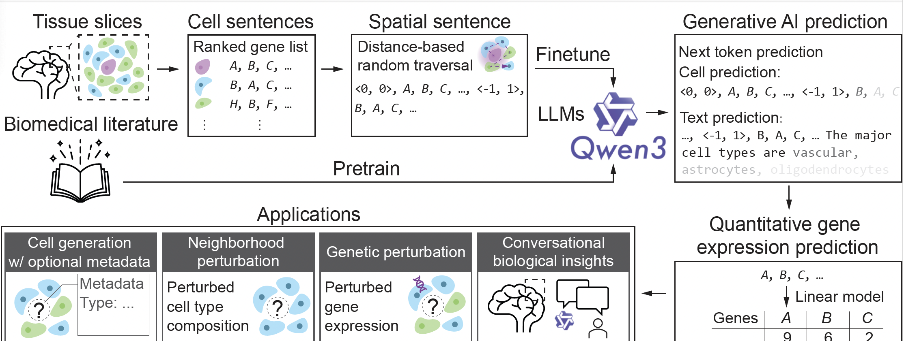

# TISSUENARRATOR: Generative Modeling of Spatial Transcriptomics with Large Language Models

## Overview

<p align="center">
  
</p>

**TissueNarrator** is a generative framework that adapts large language models (LLMs) for spatial transcriptomics (ST). By representing tissue sections as *spatial sentences*—ranked gene lists enriched with spatial coordinates and metadata—it reformulates spatial omics analysis as a language modeling problem. The model learns spatially conditioned gene expression patterns, generates realistic cell profiles, predicts intercellular interactions, and performs in silico perturbations.

## Installation


1. **Clone the Repository**

   ```bash
   git clone https://github.com/Steven51516/tissuenarrator.git
   cd tissuenarrator
   ```

2. **Install Unsloth**
    TissueNarrator relies on [Unsloth](https://github.com/unslothai/unsloth) for LLM fine-tuning.
   ```bash
    conda create --name tn_env python=3.11 \
        pytorch pytorch-cuda=12.1 cudatoolkit xformers \
        -c pytorch -c nvidia -c xformers -y
    conda activate tn_env
    pip install unsloth
    ```
2. **Install Additional Dependencies**
   ```bash
   pip install -r requirements.txt
   ```


## Tutorials

We provide several tutorials to help you get started with **TissueNarrator**:

| Name | Description |
|------|--------------|
| [Preprocess](tutorials/01_preprocess.ipynb) | Data preprocessing and spatial sentence construction |
| [Train](tutorials/02_train.ipynb) | Model fine-tuning with Unsloth |
| [Evaluate](tutorials/03_eval.ipynb) | Inference and evaluation |

## Training

The training tutorial offers a Jupyter notebook for interactive exploration, but we recommend running the standalone Python script for full training.  
Below is an example command:

```python
python -m tissuenarrator.train \
  --data ./data/merfish_train_df.parquet \
  --dataset_path ./cache_merfish \
  --output_dir ./output_merfish \
  --model_name unsloth/Qwen3-4B-Base \
  --max_seq_length 32000 \
  --epochs 3
```

## Contact
Reach us at [1405589816lsz@gmail.com](1405589816lsz@gmail.com) or open a GitHub issue.

## License
TissueNarrator is licensed under the MIT License.