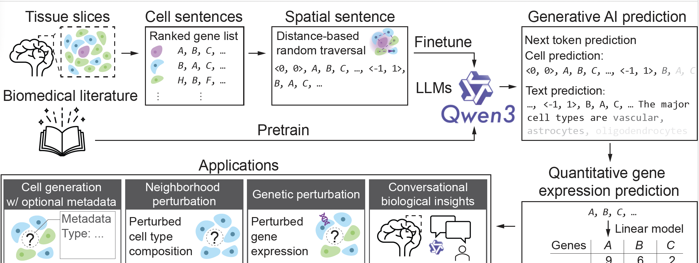

# TISSUENARRATOR: Generative Modeling of Spatial Transcriptomics with Large Language Models

## Overview

<p align="center">
  
</p>

**TissueNarrator** is a generative framework that adapts large language models (LLMs) for spatial transcriptomics (ST). By representing tissue sections as *spatial sentences*—ranked gene lists enriched with spatial coordinates and metadata—it reformulates spatial omics analysis as a language modeling problem. The model learns spatially conditioned gene expression patterns, generates realistic cell profiles, predicts intercellular interactions, and performs in silico perturbations.

## Hardware

TissueNarrator runs on standard compute servers capable of supporting large language model inference. The experiments were conducted on a server equipped with an NVIDIA A6000 GPU (48 GB VRAM).


## Operating System

TissueNarrator is Python-based and runs on all major operating systems. It has been tested on Springdale Linux.


## Installation


1. **Clone the Repository**

   ```bash
   git clone https://github.com/Steven51516/tissuenarrator.git
   cd tissuenarrator
   ```

2. **Install Unsloth**
    TissueNarrator relies on [Unsloth](https://github.com/unslothai/unsloth) for LLM fine-tuning.
   ```bash
    conda create --name tn_env python=3.11 \
        pytorch pytorch-cuda=12.1 cudatoolkit xformers \
        -c pytorch -c nvidia -c xformers -y
    conda activate tn_env
    pip install unsloth
    ```
    *This step typically takes ~8 minutes, depending on network speed and system configuration.*
2. **Install Additional Dependencies**
   ```bash
   pip install -r requirements.txt
   ```
   *This step typically takes ~2 minutes.*

   **Key package versions:**

   | Package | Version |
   | :--- | :--- |
   | **anndata** | 0.12.0 |
   | **vllm** | 0.10.1.1 |
   | **scanpy** | 1.11.4 |
   | **scipy** | 1.16.0 |
   | **scikit-learn** | 1.7.1 |
   | **numpy** | 2.2.0 |
   | **pandas** | 2.3.1 |
   | **matplotlib** | 3.10.5 |
   | **seaborn** | 0.13.2 |


## Demo

We provide a demo using the MERFISH mouse brain dataset ([paper](https://www.nature.com/articles/s41586-023-06808-9)) to help you get started with **TissueNarrator**. Please download the model checkpoint and preprocessed data [here](https://drive.google.com/drive/folders/16hO41QLqhSmegw9kFJtyIlN2DfbVbIU8?usp=sharing).

The [demo notebook](tutorials/demo.ipynb) shows how to generate cells in test sections using TissueNarrator. It typically runs in about 10 minutes, depending on your GPU setup.

We also provide tutorials for [data preprocessing](tutorials/01_preprocess.ipynb) and [training](tutorials/02_train.ipynb).

## Training

The training tutorial offers a Jupyter notebook for interactive exploration, but we recommend running the standalone Python script for full training.  
Below is an example command:

```python
python -m tissuenarrator.train \
  --data ./data/merfish_train_df.parquet \
  --dataset_path ./cache_merfish \
  --output_dir ./output_merfish \
  --model_name unsloth/Qwen3-4B-Base \
  --max_seq_length 32000 \
  --epochs 3
```

## Contact
Reach us at [1405589816lsz@gmail.com](1405589816lsz@gmail.com) or open a GitHub issue.

## License
TissueNarrator is licensed under the MIT License.